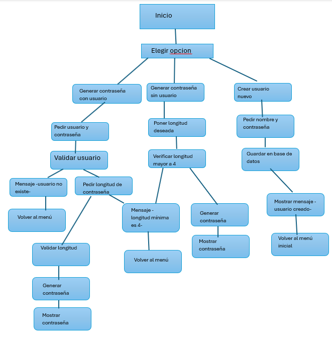
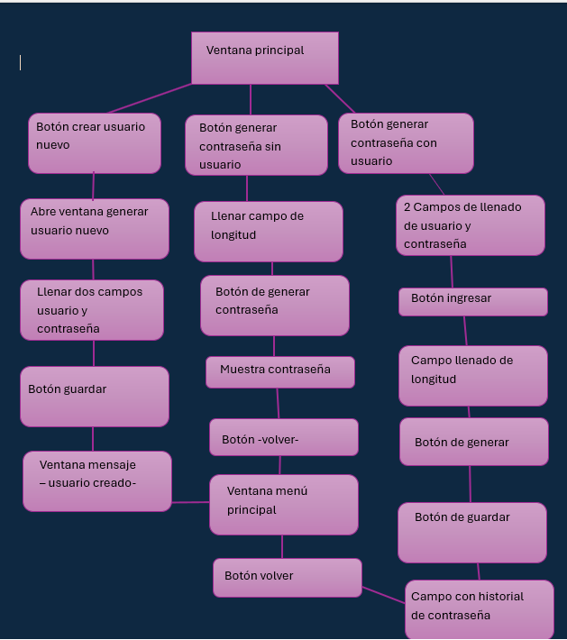

Generador Seguro de Contraseñas con Tkinter

## Tabla de Contenido
- [Introducción](#-introducción)  
- [Objetivo del Proyecto](#-objetivo-del-proyecto)  
- [Características del Software](#-características-del-software)  
  - [Gestión de Usuarios (JSON)](#1-gestión-de-usuarios-json)  
  - [Generador de Contraseñas](#2-generador-de-contraseñas)  
  - [Interfaz Gráfica (Tkinter)](#3-interfaz-gráfica-tkinter)  
- [Explicación Detallada del Código](#explicación-detallada-del-código)  
- [Diagramas de Flujo](#-diagramas-de-flujo)  
  - [Lógica del Generador de Contraseñas](#-lógica-del-generador-de-contraseñas)  
  - [Flujo de la Interfaz Gráfica](#-flujo-de-la-interfaz-gráfica)  
- [Instalación y Ejecución](#-instalación-y-ejecución)  
- [Navegación en el Programa](#-navegación-en-el-programa)   
- [Conclusiones](#-conclusiones)  
- [Datos del Proyecto](#-datos-del-proyecto)

---

## Introducción
Este proyecto corresponde a la materia **Lógica de Programación** y consiste en un **Generador Seguro de Contraseñas** desarrollado en **Python** con **interfaz gráfica (Tkinter)**.  
El software permite crear usuarios, generar contraseñas robustas y mantener un historial por usuario en un archivo JSON para persistencia.

---

## Objetivo del Proyecto
- Implementar un generador de contraseñas que cumpla criterios de seguridad (mayúsculas, minúsculas, dígitos y símbolos).  
- Proveer una interfaz gráfica accesible para usuarios sin conocimientos técnicos.  
- Guardar historial de contraseñas por usuario usando JSON para persistencia local.  
- Documentar y representar la lógica mediante diagramas de flujo.

---

## Tecnologías Utilizadas  
- **Lenguaje:** Python 3  
- **Bibliotecas:**  
  - `tkinter` → Interfaz gráfica  
  - `random`, `string` → Generación de contraseñas seguras  
  - `json` → Manejo y almacenamiento de usuarios  
  - `os` → Validación de existencia de archivos  

---

## Características del Software

### 1. Gestión de Usuarios (JSON)
- Archivo: `usuarios.json` (se crea si no existe).  
- Cada usuario almacena:
```json
{
  "usuario1": {
    "password": "claveDelUsuario",
    "historial": ["C0ntr@S3na1", "P@ssw0rd2"]
  }
}
```
- Funciones principales:
  - `cargar_usuarios()` → carga los usuarios desde `usuarios.json`.
  - `guardar_usuarios()` → escribe el diccionario `usuarios` en `usuarios.json`.

---

### 2. Generador de Contraseñas
**Función principal:** `generar_contraseña(longitud)`

**Comportamiento y reglas:**
- Valida que la longitud sea **mayor o igual a 4**; si no, devuelve `None`.  
- Fuerza la presencia de al menos:
  - 1 carácter mayúscula (`string.ascii_uppercase`)
  - 1 carácter minúscula (`string.ascii_lowercase`)
  - 1 dígito (`string.digits`)
  - 1 símbolo (`string.punctuation`)
- Rellena el resto con caracteres elegidos aleatoriamente de la unión de todos los conjuntos.  
- Mezcla (shuffle) la lista de caracteres para eliminar patrones y retorna la contraseña como una cadena.

**Ejemplo de salida:**
```
X3#qPr8!kM
```

---

### 3. Interfaz Gráfica (Tkinter)
- Ventana principal con título `Gestor Seguro de Contraseñas`, tamaño `500x400` y diseño en tonos pastel.  
- Componentes usados:
  - `Label`, `Button`, `Entry`, `Text`, `messagebox`.  
- Menú principal con botones para:
  1. Generar contraseña para un usuario (requiere login).
  2. Generar contraseña sin usuario.
  3. Crear nuevo usuario.
- Para usuarios registrados se muestra historial y se permite guardar contraseñas generadas.

---

## Explicación del Código
A continuación se describe la lógica:

1. **Carga y guardado de usuarios**
   - `ARCHIVO_USUARIOS = "usuarios.json"`
   - `cargar_usuarios()` devuelve `{}` si no existe archivo, o el diccionario cargado.
   - `guardar_usuarios()` serializa el diccionario `usuarios` con `json.dump(..., indent=4)`.

2. **Generador (`generar_contraseña(longitud)`)**
   - Validación de longitud: `if longitud < 4: return None`
   - Selección inicial garantizada:
     ```python
     contraseña = [
       random.choice(mayusculas),
       random.choice(minusculas),
       random.choice(numeros),
       random.choice(simbolos)
     ]
     ```
   - Relleno con:
     ```python
     todos = mayusculas + minusculas + numeros + simbolos
     contraseña += [random.choice(todos) for _ in range(longitud - 4)]
     random.shuffle(contraseña)
     return ''.join(contraseña)
     ```

3. **Interfaz y flujo**
   - `mostrar_menu()` crea botones para navegar entre las opciones.
   - `menu_crear_usuario()`: formulario para crear usuario; valida campos y evita duplicados.
   - `menu_usuario()`: pide credenciales; si coinciden, llama a `generar_para_usuario(usuario)`.
   - `generar_para_usuario(usuario)`: permite introducir longitud, generar, mostrar y guardar en historial.
   - `menu_sin_usuario()`: genera contraseñas sin relación a usuarios.

4. **Manejo de errores y UX**
   - Uso de `try/except` para validar entradas numéricas.
   - Mensajes con `messagebox.showerror`, `showinfo`, `showwarning`.

Diagramas de Flujo

### Lógica del Generador de Contraseñas
**Imagen:**  


---

### Flujo de la Interfaz Gráfica
**Imagen:**  



## Instalación y Ejecución

### Requisitos
- Python 3.x instalado.
- Dependencias: sólo librerías estándar (`tkinter`, `random`, `string`, `json`, `os`) — no hay módulos externos.

### 1) Clonar el repositorio
```bash
git clone https://github.com/tuusuario/Generador-Seguro-Contrasenas.git
cd Generador-Seguro-Contrasenas
```

### 2) Ejecutar el programa
```bash
python main.py
```

---

## Navegación en el Programa
- **Crear usuario** → Registrar un nuevo usuario (nombre + contraseña).  
- **Generar con usuario** → Ingresar credenciales, solicitar longitud y generar; opción de guardar en historial.  
- **Generar sin usuario** → Ingresar longitud y generar contraseña sin almacenar.

---

## Conclusiones
- El programa aplica conceptos fundamentales de **lógica de programación**: funciones, estructuras de control, manejo de archivos y diseño de interfaces.  
- El uso de **JSON** ofrece una solución simple y efectiva para la persistencia de datos sin usar bases de datos externas.  
- Los diagramas de flujo ayudan a entender el diseño del algoritmo y la interfaz.  
- El proyecto es una herramienta práctica para mejorar hábitos de seguridad personal.

---

## datos del Proyecto
- **Universidad:** Universidad Internacional del Ecuador
- **Carrera:** Ingenieria en Sitemas de la Informacion
- **Materia:** *Lógica de Programación*  
- **Autora:** Camila Sumba  
- **Fecha:** agosto / 2025
